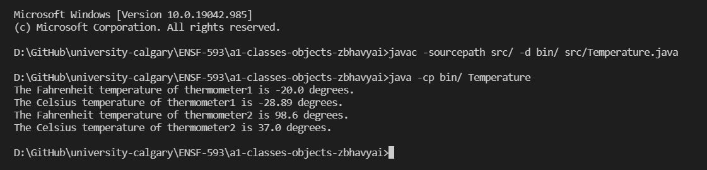

# Temperature report
Author: Bhavyai Gupta

## UML class diagram

## Specification

The Temperature class provides data fields and methods to create a data-type representing a Temperature in a Java application.

The temperature is initially stored in fahrenheit while creating the object. But the temperature can be accessed in both fahrenheit and celcius. The conversion is handled by the Temperature class.

## Execution and Testing

