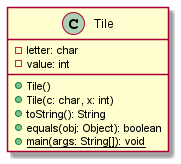

# Tile report
Author: Bhavyai Gupta

## UML class diagram

## Specification

The Tile class Provides data fields and methods to create a data-type representing a scrabble Tile in a Java application.

The Tile provides constructors to create objects of Tile, either based on default values or as supplied by the user. It also provides methods to print the object of Tile; and compare them with other objects of Tile, comparison being on the basis of character and value.

## Execution and Testing
